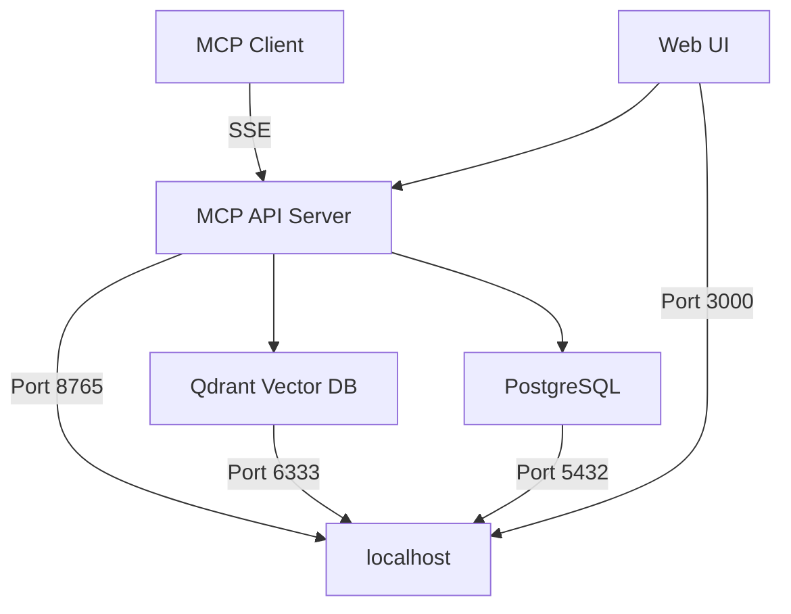

# OpenMemory MCP Server 配置

這個目錄包含部署和配置 [OpenMemory MCP Server](https://github.com/mem0ai/mem0) 所需的文件。OpenMemory 是一個本地優先的 AI 記憶體管理系統，實現了 Model Context Protocol (MCP) 標準。

## 什麼是 OpenMemory MCP？

OpenMemory MCP Server 是一個私有、本地優先的記憶體伺服器，為您的 MCP 相容工具創建共享的持久記憶層。它完全在您的機器上運行，實現工具之間的無縫上下文傳遞。

### 主要特性

- 🔒 **完全本地化**：所有記憶體儲存在本地，無雲端同步
- 🔄 **跨工具共享**：在 Claude、Cursor、Windsurf 等工具間共享記憶體
- 🎯 **語義搜尋**：使用向量嵌入進行智能記憶體檢索
- 📊 **視覺化介面**：內建 Web UI 管理記憶體
- 🛡️ **隱私優先**：資料完全由使用者控制

## 目錄結構

```
openmemory-mcp-config/
├── README.md              # 本文件
├── .env.example          # 環境變數配置範例
├── docker-compose.yml    # Docker Compose 配置
├── deployment.md         # 詳細部署指南
└── troubleshooting.md    # 故障排除指南
```

## 快速開始

### 前置需求

- Docker 24.0+
- Docker Compose 2.20+
- OpenAI API Key（用於向量嵌入）
- 4GB RAM（建議 8GB）

### 安裝步驟

1. **克隆 OpenMemory 倉庫**
   ```bash
   git clone https://github.com/mem0ai/mem0.git
   cd mem0/openmemory
   ```

2. **配置環境變數**
   ```bash
   # 複製配置範例
   cp /path/to/openmemory-mcp-config/.env.example .env
   
   # 編輯配置（填入您的 OpenAI API Key）
   nano .env
   ```

3. **啟動服務**
   ```bash
   # 使用官方 Makefile
   make build
   make up
   
   # 或使用 Docker Compose
   docker-compose up -d
   ```

4. **驗證安裝**
   - MCP API: http://localhost:8765
   - API 文檔: http://localhost:8765/docs
   - Web UI: http://localhost:3000

## 架構概覽

OpenMemory 使用微服務架構，包含以下組件：



### 服務說明

1. **MCP API Server** (Port 8765)
   - FastAPI 後端實現 MCP 協議
   - 處理記憶體的 CRUD 操作
   - 提供 SSE 端點供客戶端連線

2. **Qdrant Vector Database** (Port 6333)
   - 儲存向量嵌入
   - 執行語義相似度搜尋
   - 支援高效的向量檢索

3. **PostgreSQL** (Port 5432)
   - 儲存記憶體元資料
   - 管理使用者和存取控制
   - 提供結構化查詢支援

4. **Web UI Dashboard** (Port 3000)
   - Next.js 前端應用
   - 視覺化記憶體管理
   - 監控連線狀態

## MCP 協議實作

OpenMemory 實現了以下 MCP 工具：

### 1. `add_memories`
新增記憶體到系統
```json
{
  "tool": "add_memories",
  "memories": [{
    "content": "使用者偏好深色主題",
    "metadata": {"category": "preferences"}
  }]
}
```

### 2. `search_memory`
語義搜尋記憶體
```json
{
  "tool": "search_memory",
  "query": "使用者介面偏好",
  "limit": 5
}
```

### 3. `list_memories`
列出所有記憶體
```json
{
  "tool": "list_memories",
  "user_id": "username",
  "category": "preferences"
}
```

### 4. `delete_all_memories`
清除所有記憶體
```json
{
  "tool": "delete_all_memories",
  "confirm": true
}
```

## 客戶端整合

### Claude Desktop
```bash
npx install-mcp i "http://localhost:8765/mcp/claude/sse/$(whoami)" --client claude
```

### Claude Code CLI
```bash
claude mcp add openmemory --transport sse \
  "http://localhost:8765/mcp/sse/claude/$(whoami)"
```

### Cursor
```bash
npx install-mcp i "http://localhost:8765/mcp/cursor/sse/$(whoami)" --client cursor
```

## 安全考量

1. **資料隱私**
   - 所有資料儲存在本地
   - 無外部資料傳輸（除了 OpenAI 嵌入 API）
   - 支援資料加密

2. **存取控制**
   - 基於使用者 ID 的記憶體隔離
   - 客戶端特定的命名空間
   - 審計日誌記錄

3. **網路安全**
   - 預設僅本地存取
   - 支援 TLS/HTTPS 配置
   - CORS 保護

## 故障排除

常見問題和解決方案請參考 [troubleshooting.md](./troubleshooting.md)。

### 快速診斷

```bash
# 檢查服務狀態
docker-compose ps

# 查看日誌
docker-compose logs -f

# 測試 API
curl http://localhost:8765/health
```

## 進階配置

### 自訂向量模型

在 `.env` 中配置：
```env
EMBEDDING_MODEL=text-embedding-3-small
EMBEDDING_DIMENSION=1536
```

### 記憶體保留策略

```env
MEMORY_RETENTION_DAYS=90
MAX_MEMORY_SIZE_MB=100
```

### 效能調校

```yaml
# docker-compose.yml
services:
  openmemory-mcp:
    deploy:
      resources:
        limits:
          cpus: '2'
          memory: 4G
```

## 貢獻

歡迎貢獻！請查看：
- [OpenMemory GitHub](https://github.com/mem0ai/mem0)
- [MCP 協議規範](https://modelcontextprotocol.io)

## 授權

本配置文件採用 MIT 授權。OpenMemory 本身的授權請參考其官方倉庫。

## 相關資源

- [OpenMemory 官方文檔](https://docs.mem0.ai/openmemory)
- [MCP 協議文檔](https://modelcontextprotocol.io/docs)
- [Mem0 框架](https://github.com/mem0ai/mem0)
- [部署指南](./deployment.md)
- [故障排除](./troubleshooting.md)