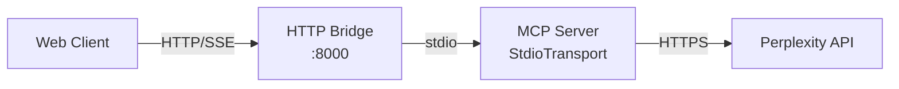
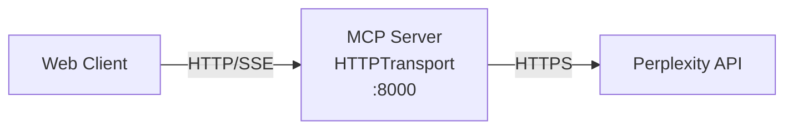

# Perplexity MCP Custom Server 2.0 架構設計

## 架構概覽

### 現有架構 (v1.x)



### 目標架構 (v2.0)



## 核心組件設計

### 1. HTTPServerTransport

實作 MCP Streamable HTTP Transport 規範：

```typescript
interface HTTPServerTransportOptions {
  port: number;
  host?: string;
  endpoint?: string;  // 預設: '/mcp'
  corsOptions?: CorsOptions;
  sessionTimeout?: number;
  maxConnections?: number;
}

class HTTPServerTransport implements Transport {
  private server: http.Server;
  private sessions: Map<string, Session>;
  private sseConnections: Map<string, SSEConnection>;
  
  constructor(options: HTTPServerTransportOptions) {
    this.setupServer(options);
    this.setupEndpoints();
  }
  
  // 核心方法
  async start(): Promise<void>;
  async send(message: JSONRPCMessage): Promise<void>;
  async close(): Promise<void>;
  
  // 回調
  onmessage?: (message: JSONRPCMessage) => void;
  onerror?: (error: Error) => void;
  onclose?: () => void;
}
```

### 2. 請求處理器

統一的 MCP 端點處理：

```typescript
class MCPRequestHandler {
  async handleRequest(req: Request, res: Response) {
    const method = req.method;
    const contentType = req.headers['content-type'];
    const acceptHeader = req.headers['accept'];
    
    switch (method) {
      case 'POST':
        await this.handlePost(req, res);
        break;
      case 'GET':
        await this.handleGet(req, res);
        break;
      case 'DELETE':
        await this.handleDelete(req, res);
        break;
      default:
        res.status(405).send('Method Not Allowed');
    }
  }
  
  private async handlePost(req: Request, res: Response) {
    // 處理 JSON-RPC 請求
    const message = req.body;
    
    if (this.isResponse(message) || this.isNotification(message)) {
      // 返回 202 Accepted
      res.status(202).end();
    } else if (this.isRequest(message)) {
      // 處理請求並決定響應方式
      const needsStreaming = this.checkStreamingNeeded(message);
      
      if (needsStreaming) {
        // 初始化 SSE
        this.initializeSSE(req, res);
      } else {
        // 返回單一 JSON 響應
        const response = await this.processRequest(message);
        res.json(response);
      }
    }
  }
  
  private async handleGet(req: Request, res: Response) {
    // 建立 SSE 連接
    if (req.headers.accept?.includes('text/event-stream')) {
      this.establishSSEConnection(req, res);
    } else {
      res.status(406).send('Not Acceptable');
    }
  }
}
```

### 3. 會話管理

實作 MCP 會話管理規範：

```typescript
interface Session {
  id: string;
  clientInfo: ClientInfo;
  capabilities: ClientCapabilities;
  createdAt: Date;
  lastActivity: Date;
  sseConnections: Set<string>;
}

class SessionManager {
  private sessions = new Map<string, Session>();
  private sessionTimeout: number;
  
  generateSessionId(): string {
    // 生成符合規範的會話 ID
    // 只包含可見 ASCII 字符 (0x21-0x7E)
    return crypto.randomBytes(32).toString('base64url');
  }
  
  createSession(clientInfo: ClientInfo): Session {
    const session: Session = {
      id: this.generateSessionId(),
      clientInfo,
      capabilities: {},
      createdAt: new Date(),
      lastActivity: new Date(),
      sseConnections: new Set()
    };
    
    this.sessions.set(session.id, session);
    this.scheduleCleanup(session.id);
    
    return session;
  }
  
  validateSession(sessionId: string): boolean {
    const session = this.sessions.get(sessionId);
    if (!session) return false;
    
    session.lastActivity = new Date();
    return true;
  }
  
  terminateSession(sessionId: string): void {
    const session = this.sessions.get(sessionId);
    if (session) {
      // 關閉所有相關的 SSE 連接
      session.sseConnections.forEach(connId => {
        this.closeSSEConnection(connId);
      });
      
      this.sessions.delete(sessionId);
    }
  }
}
```

### 4. SSE 流管理

處理 Server-Sent Events：

```typescript
interface SSEConnection {
  id: string;
  sessionId: string;
  response: Response;
  lastEventId?: string;
  isAlive: boolean;
}

class SSEManager {
  private connections = new Map<string, SSEConnection>();
  
  establish(sessionId: string, res: Response): SSEConnection {
    const connection: SSEConnection = {
      id: crypto.randomUUID(),
      sessionId,
      response: res,
      isAlive: true
    };
    
    // 設置 SSE headers
    res.writeHead(200, {
      'Content-Type': 'text/event-stream',
      'Cache-Control': 'no-cache',
      'Connection': 'keep-alive',
      'X-Accel-Buffering': 'no'  // 禁用 nginx 緩衝
    });
    
    // 發送初始化事件
    this.sendEvent(connection.id, {
      event: 'connected',
      data: { sessionId }
    });
    
    // 設置心跳
    this.setupHeartbeat(connection.id);
    
    this.connections.set(connection.id, connection);
    return connection;
  }
  
  sendMessage(sessionId: string, message: JSONRPCMessage): void {
    const connections = this.getSessionConnections(sessionId);
    
    // 根據規範：只在一個連接上發送
    const targetConn = connections[0];
    if (targetConn) {
      this.sendEvent(targetConn.id, {
        event: 'message',
        data: message,
        id: this.generateEventId()  // 支援恢復
      });
    }
  }
  
  private sendEvent(connId: string, event: SSEEvent): void {
    const conn = this.connections.get(connId);
    if (conn?.isAlive) {
      let data = '';
      
      if (event.id) data += `id: ${event.id}\n`;
      if (event.event) data += `event: ${event.event}\n`;
      data += `data: ${JSON.stringify(event.data)}\n\n`;
      
      conn.response.write(data);
    }
  }
}
```

### 5. 向後兼容層

過渡期支援 stdio 模式：

```typescript
class DualModeServer {
  private httpTransport?: HTTPServerTransport;
  private stdioTransport?: StdioServerTransport;
  
  constructor(options: ServerOptions) {
    if (options.mode === 'http' || options.mode === 'dual') {
      this.httpTransport = new HTTPServerTransport(options.http);
    }
    
    if (options.mode === 'stdio' || options.mode === 'dual') {
      this.stdioTransport = new StdioServerTransport();
    }
  }
  
  async start(): Promise<void> {
    const promises: Promise<void>[] = [];
    
    if (this.httpTransport) {
      promises.push(this.httpTransport.start());
    }
    
    if (this.stdioTransport) {
      promises.push(this.stdioTransport.start());
    }
    
    await Promise.all(promises);
  }
}
```

## API 端點規範

### 主要端點

```
POST /mcp
GET  /mcp  
DELETE /mcp
```

### 請求頭要求

#### POST 請求
```http
Content-Type: application/json
Accept: application/json, text/event-stream
MCP-Protocol-Version: 2025-06-18
Mcp-Session-Id: <session-id>  # 初始化後必須
```

#### GET 請求（SSE）
```http
Accept: text/event-stream
MCP-Protocol-Version: 2025-06-18
Mcp-Session-Id: <session-id>
Last-Event-ID: <last-id>  # 恢復連接時
```

### 響應格式

#### 初始化響應
```http
HTTP/1.1 200 OK
Content-Type: application/json
Mcp-Session-Id: 1868a90c-7d3f-4a9b-8f2b-5c6d7e8f9a0b

{
  "jsonrpc": "2.0",
  "id": 1,
  "result": {
    "protocolVersion": "2025-06-18",
    "capabilities": { ... },
    "serverInfo": { ... }
  }
}
```

#### SSE 事件格式
```
id: evt_123456789
event: message
data: {"jsonrpc":"2.0","method":"...","params":{...}}

id: evt_123456790
event: message  
data: {"jsonrpc":"2.0","id":1,"result":{...}}
```

## 安全考量

### 1. Origin 驗證

防止 DNS 重新綁定攻擊：

```typescript
const allowedOrigins = ['http://localhost:3000', 'https://app.example.com'];

if (!allowedOrigins.includes(req.headers.origin)) {
  res.status(403).send('Forbidden');
  return;
}
```

### 2. 本地綁定

僅綁定到 localhost：

```typescript
server.listen(port, '127.0.0.1', () => {
  console.log(`Server listening on localhost:${port}`);
});
```

### 3. 認證機制

支援 Bearer token：

```typescript
const token = req.headers.authorization?.replace('Bearer ', '');
if (!validateToken(token)) {
  res.status(401).send('Unauthorized');
  return;
}
```

## 效能優化

### 1. 連接池管理

限制並發連接數：

```typescript
class ConnectionPool {
  private maxConnections = 100;
  private activeConnections = 0;
  
  canAccept(): boolean {
    return this.activeConnections < this.maxConnections;
  }
}
```

### 2. 請求批處理

支援批量 JSON-RPC 請求：

```typescript
if (Array.isArray(message)) {
  const responses = await Promise.all(
    message.map(m => this.processRequest(m))
  );
  res.json(responses);
}
```

### 3. 快取策略

整合現有 LRU 快取：

```typescript
const cacheKey = generateCacheKey(request);
const cached = cache.get(cacheKey);

if (cached && !isExpired(cached)) {
  return cached.value;
}
```

## 遷移策略

### 階段 1：雙模式運行
- 同時支援 stdio 和 HTTP
- 現有用戶無感升級

### 階段 2：預設 HTTP
- 新用戶預設使用 HTTP
- stdio 需要明確指定

### 階段 3：廢棄 stdio  
- 發出廢棄警告
- 提供遷移工具

### 階段 4：移除 stdio
- 完全移除 stdio 支援
- 簡化代碼庫

## 測試策略

### 單元測試
- Transport 層測試
- Session 管理測試
- SSE 連接測試

### 整合測試
- 端到端流程測試
- 多客戶端測試
- 錯誤恢復測試

### 性能測試
- 負載測試
- 延遲測試
- 記憶體洩漏測試

## 部署考量

### Docker 支援

```dockerfile
FROM node:20-alpine
WORKDIR /app
COPY . .
RUN npm ci --production
EXPOSE 8000
CMD ["node", "dist/index.js", "--mode=http"]
```

### 環境變數

```bash
MCP_MODE=http           # http, stdio, dual
MCP_PORT=8000          
MCP_HOST=127.0.0.1
MCP_ENDPOINT=/mcp
MCP_SESSION_TIMEOUT=3600000
MCP_MAX_CONNECTIONS=100
```

## 監控與日誌

### 關鍵指標
- 活躍會話數
- SSE 連接數
- 請求延遲
- 錯誤率

### 結構化日誌

```typescript
logger.info('request_received', {
  method: req.method,
  path: req.path,
  sessionId: req.headers['mcp-session-id'],
  protocol: req.headers['mcp-protocol-version']
});
```

## 結論

V2.0 架構設計完全符合 MCP Streamable HTTP 規範，提供了更簡潔、高效的實作。通過漸進式遷移策略，確保平滑過渡，最終實現架構現代化。