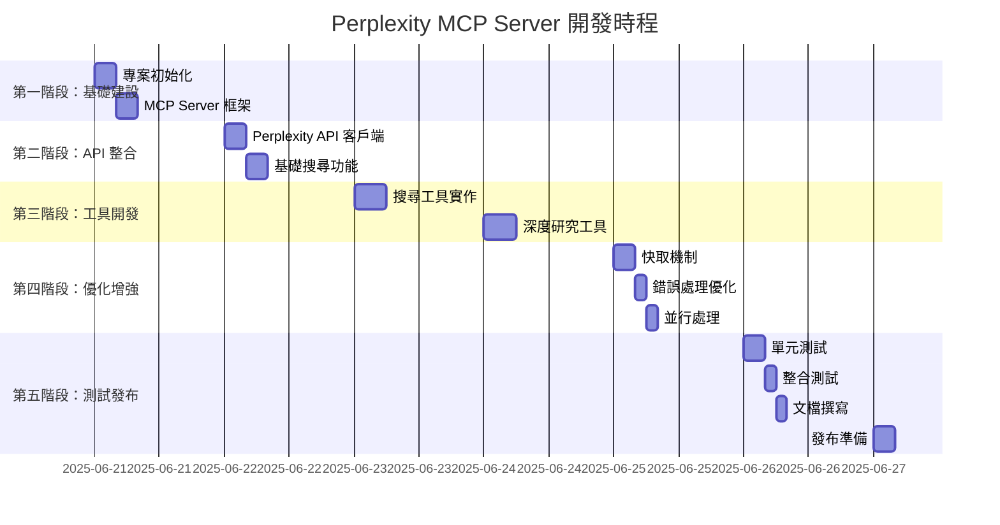

# Perplexity MCP Server 開發計劃

**專案代號**: perplexity-mcp-custom  
**開始日期**: 2025-06-21  
**預計完成**: 2025-06-27  
**版本目標**: v1.0.0

## 一、專案概述

### 1.1 專案目標
開發一個完全符合 MCP 協議 2025-06-18 標準的 Perplexity MCP Server，解決現有實作的相容性問題，並提供更豐富的功能。

### 1.2 核心價值
- ✅ 完全符合 JSON Schema draft 2020-12
- ✅ 支援全域註冊（-g 參數）
- ✅ 優秀的錯誤處理和使用者體驗
- ✅ 豐富的進階功能

## 二、開發時程表

### 2.1 甘特圖


### 2.2 詳細時程

#### Day 1 (2025-06-21) - 基礎建設
- [ ] 09:00-10:00: 專案結構初始化
- [ ] 10:00-12:00: TypeScript 環境配置
- [ ] 14:00-16:00: MCP SDK 整合
- [ ] 16:00-18:00: 基礎 Server 實作

#### Day 2 (2025-06-22) - API 整合
- [ ] 09:00-11:00: Perplexity API 研究
- [ ] 11:00-13:00: API 客戶端開發
- [ ] 14:00-16:00: 認證機制實作
- [ ] 16:00-18:00: 基礎搜尋測試

#### Day 3 (2025-06-23) - 搜尋工具
- [ ] 09:00-12:00: Schema 定義與驗證
- [ ] 14:00-17:00: 搜尋工具完整實作
- [ ] 17:00-18:00: 單元測試

#### Day 4 (2025-06-24) - 深度研究
- [ ] 09:00-12:00: Deep Research API 研究
- [ ] 14:00-17:00: 深度研究工具實作
- [ ] 17:00-18:00: 整合測試

#### Day 5 (2025-06-25) - 優化增強
- [ ] 09:00-11:00: LRU 快取實作
- [ ] 11:00-13:00: 錯誤處理系統
- [ ] 14:00-16:00: 並行處理優化
- [ ] 16:00-18:00: 效能測試

#### Day 6 (2025-06-26) - 測試完善
- [ ] 09:00-11:00: 完整單元測試
- [ ] 11:00-13:00: 整合測試案例
- [ ] 14:00-16:00: 文檔撰寫
- [ ] 16:00-18:00: 範例程式

#### Day 7 (2025-06-27) - 發布準備
- [ ] 09:00-11:00: 最終測試
- [ ] 11:00-13:00: 發布文件準備
- [ ] 14:00-16:00: npm 發布
- [ ] 16:00-18:00: 社群公告

## 三、技術實作細節

### 3.1 核心架構
```typescript
// src/server.ts
import { Server } from "@modelcontextprotocol/sdk/server/index.js";
import { StdioServerTransport } from "@modelcontextprotocol/sdk/server/stdio.js";

export class PerplexityMCPServer {
  private server: Server;
  private apiClient: PerplexityAPIClient;
  private cache: LRUCache<string, SearchResult>;

  constructor(config: ServerConfig) {
    this.server = new Server({
      name: "perplexity-mcp-custom",
      version: "1.0.0",
      description: "Enhanced Perplexity MCP Server with full protocol compliance"
    });
    
    this.apiClient = new PerplexityAPIClient(config.apiKey);
    this.cache = new LRUCache({ max: 100, ttl: 1000 * 60 * 60 }); // 1 hour TTL
    
    this.setupHandlers();
  }

  private setupHandlers(): void {
    // 工具列表處理
    this.server.setRequestHandler("tools/list", this.handleToolsList.bind(this));
    
    // 工具執行處理
    this.server.setRequestHandler("tools/call", this.handleToolCall.bind(this));
    
    // 資源處理（未來擴展）
    this.server.setRequestHandler("resources/list", this.handleResourcesList.bind(this));
  }
}
```

### 3.2 工具定義
```typescript
// src/tools/schemas.ts
export const SEARCH_TOOL_SCHEMA = {
  type: "object" as const,
  properties: {
    query: {
      type: "string",
      description: "搜尋查詢字串",
      minLength: 1,
      maxLength: 1000
    },
    model: {
      type: "string",
      enum: ["sonar", "sonar-pro", "sonar-deep-research"],
      default: "sonar-pro"
    },
    options: {
      type: "object",
      properties: {
        search_domain: { type: "string" },
        search_recency: {
          type: "string",
          enum: ["day", "week", "month", "year"]
        },
        return_citations: {
          type: "boolean",
          default: true
        },
        return_images: {
          type: "boolean",
          default: false
        },
        return_related_questions: {
          type: "boolean",
          default: false
        }
      },
      additionalProperties: false
    }
  },
  required: ["query"],
  additionalProperties: false
};

export const DEEP_RESEARCH_TOOL_SCHEMA = {
  type: "object" as const,
  properties: {
    topic: {
      type: "string",
      description: "研究主題",
      minLength: 1,
      maxLength: 500
    },
    depth: {
      type: "string",
      enum: ["quick", "standard", "comprehensive"],
      default: "standard",
      description: "研究深度"
    },
    focus_areas: {
      type: "array",
      items: { type: "string" },
      description: "重點研究領域"
    }
  },
  required: ["topic"],
  additionalProperties: false
};
```

### 3.3 API 客戶端
```typescript
// src/api/client.ts
export class PerplexityAPIClient {
  private baseURL = "https://api.perplexity.ai";
  private apiKey: string;

  constructor(apiKey: string) {
    if (!apiKey) {
      throw new Error("Perplexity API key is required");
    }
    this.apiKey = apiKey;
  }

  async search(params: SearchParams): Promise<SearchResult> {
    const response = await fetch(`${this.baseURL}/chat/completions`, {
      method: "POST",
      headers: {
        "Authorization": `Bearer ${this.apiKey}`,
        "Content-Type": "application/json"
      },
      body: JSON.stringify({
        model: params.model || "sonar-pro",
        messages: [{
          role: "user",
          content: params.query
        }],
        ...params.options
      })
    });

    if (!response.ok) {
      throw new PerplexityAPIError(response.status, await response.text());
    }

    return this.formatResponse(await response.json());
  }

  private formatResponse(raw: any): SearchResult {
    return {
      content: raw.choices[0].message.content,
      citations: raw.citations || [],
      images: raw.images || [],
      related_questions: raw.related_questions || []
    };
  }
}
```

## 四、測試策略

### 4.1 測試金字塔
```
        /\
       /  \    E2E 測試 (10%)
      /    \   - 完整流程測試
     /------\  整合測試 (30%)
    /        \ - API 整合測試
   /          \- MCP 協議測試
  /------------\單元測試 (60%)
 /              \- 工具邏輯測試
/________________\- Schema 驗證測試
```

### 4.2 測試案例
1. **單元測試**
   - Schema 驗證測試
   - API 客戶端測試
   - 快取邏輯測試
   - 錯誤處理測試

2. **整合測試**
   - MCP 協議相容性測試
   - API 端到端測試
   - 並發處理測試

3. **E2E 測試**
   - Claude CLI 整合測試
   - 實際搜尋場景測試

## 五、發布計劃

### 5.1 版本策略
- **v0.1.0** - Alpha: 基礎功能 (Day 3)
- **v0.5.0** - Beta: 完整功能 (Day 5)
- **v1.0.0** - Release: 穩定版本 (Day 7)

### 5.2 發布清單
- [ ] 程式碼審查
- [ ] 安全性檢查
- [ ] 效能基準測試
- [ ] 文檔完整性檢查
- [ ] LICENSE 檔案
- [ ] npm 發布設定
- [ ] GitHub Release
- [ ] 社群公告

### 5.3 發布渠道
1. **npm Registry**
   ```bash
   npm publish --access public
   ```

2. **GitHub Releases**
   - 原始碼壓縮包
   - 編譯後的檔案
   - 更新日誌

3. **社群推廣**
   - MCP Discord 社群
   - GitHub Discussions
   - Twitter/X 公告

## 六、文檔計劃

### 6.1 使用者文檔
- **README.md** - 快速開始指南
- **INSTALLATION.md** - 詳細安裝說明
- **CONFIGURATION.md** - 配置選項
- **EXAMPLES.md** - 使用範例

### 6.2 開發者文檔
- **CONTRIBUTING.md** - 貢獻指南
- **ARCHITECTURE.md** - 架構設計
- **API.md** - API 參考
- **CHANGELOG.md** - 版本更新日誌

### 6.3 範例程式
```typescript
// examples/basic-search.ts
import { PerplexityMCPServer } from "perplexity-mcp-custom";

const server = new PerplexityMCPServer({
  apiKey: process.env.PERPLEXITY_API_KEY
});

// 啟動伺服器
server.start();
```

## 七、風險管理

### 7.1 風險追蹤
| 風險項目 | 當前狀態 | 緩解措施 | 負責人 |
|---------|---------|---------|--------|
| API 變更 | 🟢 低風險 | 版本鎖定 | Dev |
| Schema 相容性 | 🟢 已解決 | 嚴格測試 | Dev |
| 時程延遲 | 🟡 監控中 | 緩衝時間 | PM |
| 效能問題 | 🟢 低風險 | 快取優化 | Dev |

### 7.2 應變計劃
1. **時程延遲**: 優先完成 MVP，進階功能可延後
2. **技術障礙**: 尋求社群協助，參考官方範例
3. **API 問題**: 準備 mock 服務，確保開發進度

## 八、成功指標

### 8.1 技術指標
- [ ] 100% Schema 相容性測試通過
- [ ] 平均回應時間 < 200ms
- [ ] 測試覆蓋率 > 80%
- [ ] 零安全漏洞

### 8.2 使用者指標
- [ ] 安裝零錯誤
- [ ] 清晰的錯誤訊息
- [ ] 完整的文檔
- [ ] 正面的使用者反饋

### 8.3 專案指標
- [ ] 按時交付
- [ ] 預算內完成
- [ ] 程式碼品質 A 級
- [ ] 可維護性高

## 九、資源需求

### 9.1 人力資源
- **開發人員**: 1 人（全職 7 天）
- **測試支援**: 社群測試者
- **文檔審查**: 1 人（兼職）

### 9.2 技術資源
- **開發環境**: Node.js 20+, TypeScript 5+
- **測試 API**: Perplexity API 測試額度
- **CI/CD**: GitHub Actions

### 9.3 預算估算
- **API 測試費用**: $10-20
- **網域/託管**: $0（使用 GitHub）
- **其他工具**: $0（開源工具）

## 十、溝通計劃

### 10.1 內部溝通
- **每日站會**: 09:00 (5 分鐘)
- **進度更新**: 每日結束前
- **問題升級**: 即時

### 10.2 外部溝通
- **社群更新**: 每 2 天
- **部落格文章**: 發布時
- **技術分享**: 發布後 1 週

## 附件

### A. 技術規格書
- 詳細 API 規格
- Schema 定義
- 錯誤碼表

### B. 測試計劃書
- 測試案例清單
- 測試環境配置
- 驗收標準

### C. 發布檢查清單
- 程式碼品質檢查
- 安全性檢查
- 文檔完整性檢查