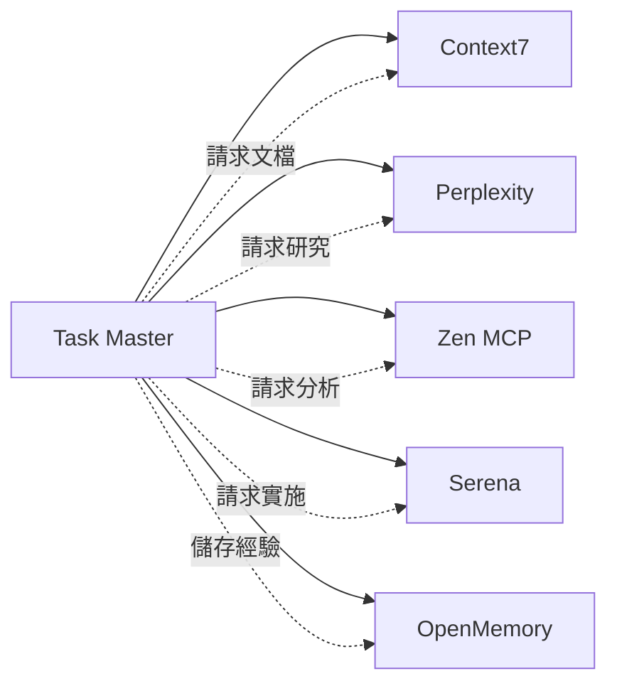
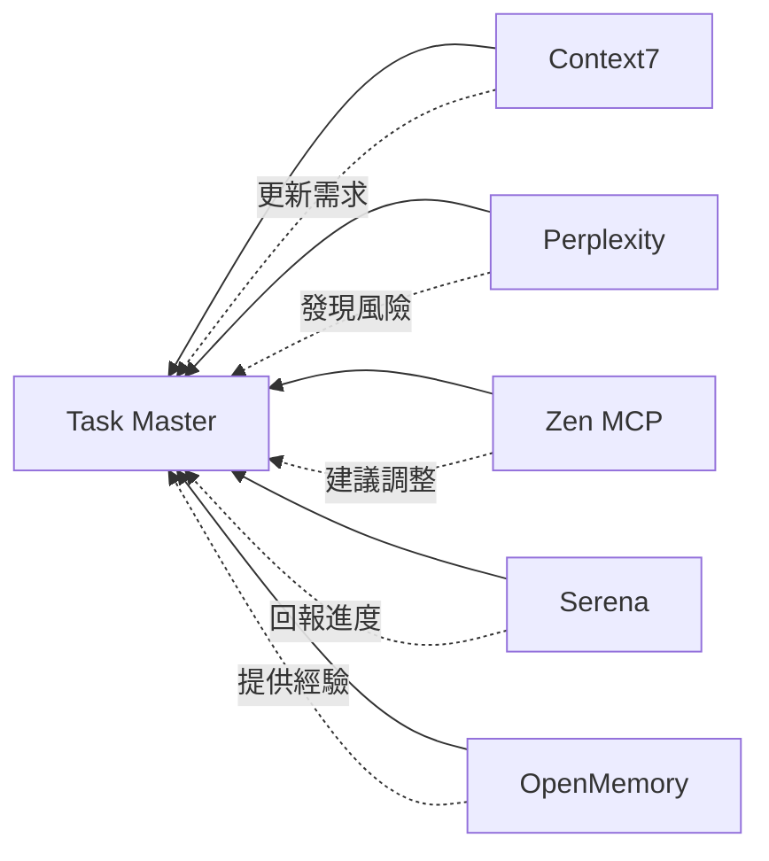
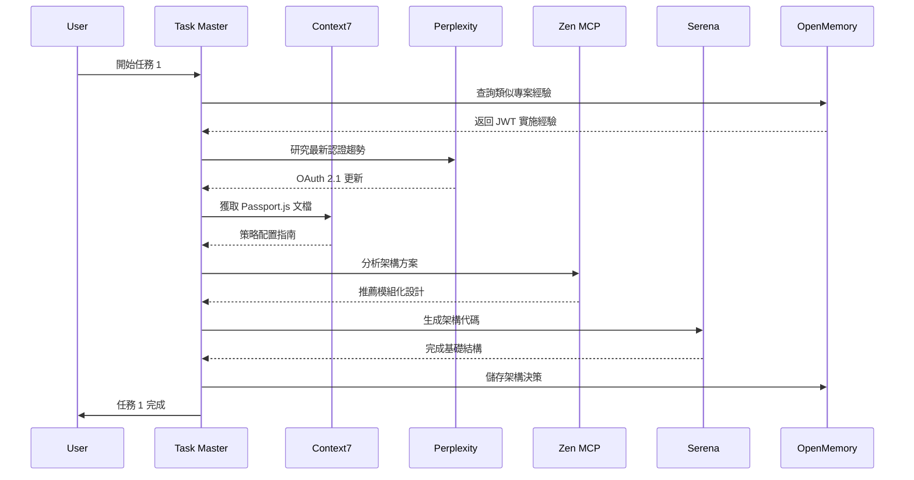

# Claude Task Master 與五大 MCP Server 協同效應分析

本文檔深入分析 Claude Task Master 如何與現有五個 MCP Server（Context7、Perplexity、Zen MCP、OpenMemory、Serena）形成協同效應，創造「1+1+1+1+1+1>6」的價值。

## 目錄

1. [六大 MCP Server 生態系統架構](#六大-mcp-server-生態系統架構)
2. [Task Master 的獨特定位](#task-master-的獨特定位)
3. [雙向協同模式](#雙向協同模式)
4. [實際應用場景](#實際應用場景)
5. [協同工作流程](#協同工作流程)
6. [價值倍增效應](#價值倍增效應)

## 六大 MCP Server 生態系統架構

### 整體架構圖

```
┌─────────────────────────────────────────────────────────────┐
│                        使用者介面                              │
│                    Claude Code CLI                           │
└─────────────────────┬───────────────────────────────────────┘
                      │
┌─────────────────────┴───────────────────────────────────────┐
│                   MCP Protocol Layer                         │
└─────────────────────┬───────────────────────────────────────┘
                      │
┌─────────────────────┴───────────────────────────────────────┐
│                   協調層 (Task Master)                        │
│  ┌─────────────┐  ┌─────────────┐  ┌─────────────┐        │
│  │ 任務規劃     │  │ 進度追蹤     │  │ 資源調度     │        │
│  └─────────────┘  └─────────────┘  └─────────────┘        │
└─────────────────────┬───────────────────────────────────────┘
                      │
┌─────────────────────┴───────────────────────────────────────┐
│                      執行層                                   │
│  ┌──────────┐  ┌──────────┐  ┌──────────┐  ┌──────────┐   │
│  │ Context7 │  │Perplexity│  │ Zen MCP  │  │  Serena  │   │
│  │ 技術文檔  │  │ 即時研究  │  │ AI協作   │  │程式碼分析 │   │
│  └──────────┘  └──────────┘  └──────────┘  └──────────┘   │
└─────────────────────┬───────────────────────────────────────┘
                      │
┌─────────────────────┴───────────────────────────────────────┐
│                   持久層 (OpenMemory)                         │
│              知識儲存 | 經驗累積 | 決策記錄                    │
└─────────────────────────────────────────────────────────────┘
```

### 層級職責

1. **協調層（Task Master）**：專案管理指揮官
   - 任務分解和規劃
   - 資源調度和協調
   - 進度監控和報告

2. **執行層（四大執行 MCP）**：專業執行團隊
   - Context7：技術知識供應
   - Perplexity：即時資訊偵察
   - Zen MCP：深度分析決策
   - Serena：程式碼理解實施

3. **持久層（OpenMemory）**：組織記憶體
   - 經驗知識累積
   - 決策歷史追蹤
   - 跨專案學習

## Task Master 的獨特定位

### 核心價值主張

Task Master 不是另一個執行工具，而是整個開發流程的**協調中樞**：

| 特性 | Task Master | 其他 MCP Servers |
|-----|------------|-----------------|
| 主要角色 | 協調者、規劃者 | 執行者、分析者 |
| 工作重點 | 流程管理、資源調度 | 具體任務執行 |
| 輸出類型 | 結構化任務、進度報告 | 分析結果、程式碼 |
| 時間跨度 | 專案全生命週期 | 單次任務執行 |

### 填補的關鍵空白

1. **流程結構化**：將模糊的需求轉化為可執行的任務
2. **資源協調**：智能調度其他 MCP Server
3. **進度可視化**：即時追蹤專案狀態
4. **知識串連**：連接任務與執行結果

## 雙向協同模式

### 1. Task Master → 其他 MCP Servers



**具體調用範例**：

```javascript
// Task Master 協調其他服務
async function implementTask(taskId) {
  const task = await getTask(taskId);
  
  // 1. 從 Context7 獲取相關文檔
  const docs = await context7.getLibraryDocs({
    library: task.techStack[0],
    topic: task.keywords
  });
  
  // 2. 使用 Perplexity 研究最佳實踐
  const research = await perplexity.research({
    query: `${task.title} best practices 2024`,
    depth: 'comprehensive'
  });
  
  // 3. 請求 Zen MCP 分析實施方案
  const analysis = await zenMcp.analyze({
    task: task,
    context: { docs, research }
  });
  
  // 4. 使用 Serena 實施程式碼
  const implementation = await serena.implement({
    plan: analysis.plan,
    targetFiles: task.files
  });
  
  // 5. 儲存到 OpenMemory
  await openMemory.save({
    taskId: task.id,
    decisions: analysis.decisions,
    implementation: implementation.summary,
    lessons: implementation.lessons
  });
}
```

### 2. 其他 MCP Servers → Task Master



**反饋整合範例**：

```javascript
// 其他服務向 Task Master 反饋
class TaskMasterFeedbackHandler {
  // Context7 發現新的 API 變更
  async handleDocumentationUpdate(update) {
    if (update.breaking) {
      await taskMaster.createTask({
        title: `更新程式碼以適應 ${update.library} v${update.version}`,
        priority: 'high',
        dependencies: update.affectedTasks
      });
    }
  }
  
  // Perplexity 發現安全問題
  async handleSecurityAlert(alert) {
    await taskMaster.escalateTask({
      taskId: alert.relatedTask,
      priority: 'critical',
      reason: alert.description
    });
  }
  
  // Zen MCP 建議任務分解
  async handleComplexityAnalysis(analysis) {
    if (analysis.complexity > 8) {
      await taskMaster.expandTask({
        taskId: analysis.taskId,
        subtasks: analysis.suggestedSubtasks
      });
    }
  }
  
  // Serena 回報實施困難
  async handleImplementationIssue(issue) {
    await taskMaster.updateTask({
      taskId: issue.taskId,
      status: 'blocked',
      blocker: issue.description,
      needsResearch: true
    });
  }
  
  // OpenMemory 提供相似經驗
  async handleSimilarExperience(memory) {
    await taskMaster.annotateTask({
      taskId: memory.currentTask,
      note: `參考之前的經驗：${memory.summary}`,
      previousTaskId: memory.similarTask
    });
  }
}
```

## 實際應用場景

### 場景 1：全棧功能開發

**需求**：實現一個完整的用戶認證系統

```bash
# 1. Task Master 解析需求
task-master parse-prd auth-requirements.txt

# 生成任務結構：
# - Task 1: 設計認證架構
# - Task 2: 實現後端 API
# - Task 3: 建立前端介面
# - Task 4: 整合測試
```

**協同流程**：



### 場景 2：生產環境 Bug 修復

**情況**：用戶報告登入功能間歇性失敗

```bash
# Task Master 建立緊急任務
task-master add-task --prompt="修復登入間歇性失敗" \
  --priority=critical --tag=hotfix
```

**協同解決流程**：

1. **Task Master 協調調查**：
   ```javascript
   // 自動觸發調查流程
   await taskMaster.investigateBug({
     symptoms: "間歇性登入失敗",
     affectedComponents: ["auth", "session", "database"]
   });
   ```

2. **Perplexity 快速研究**：
   ```javascript
   // 搜尋類似問題
   const similar = await perplexity.search({
     query: "JWT token race condition login failure",
     recency: "week"
   });
   ```

3. **Zen MCP 深度調試**：
   ```javascript
   // 系統化調試
   const debug = await zenMcp.debug({
     hypothesis: "Session 競態條件",
     files: ["auth/session.js", "middleware/auth.js"]
   });
   ```

4. **Serena 定位問題**：
   ```javascript
   // 程式碼分析
   const analysis = await serena.analyze({
     pattern: "async session handling",
     scope: "auth module"
   });
   ```

5. **OpenMemory 預防復發**：
   ```javascript
   // 記錄解決方案
   await openMemory.recordIncident({
     issue: "Session 競態條件",
     rootCause: "非原子性 session 更新",
     solution: "使用 Redis 事務",
     prevention: "添加並發測試"
   });
   ```

### 場景 3：技術債務清理

**目標**：系統性清理累積的技術債務

```bash
# Task Master 技術債務分析
task-master analyze-tech-debt --generate-tasks
```

**多層協同清理**：

```yaml
Phase 1 - 識別階段:
  Task Master: 列出所有技術債務類型
  Serena: 掃描程式碼品質問題
  Zen MCP: 分析架構缺陷
  Result: 優先級排序的債務清單

Phase 2 - 規劃階段:
  Task Master: 建立清理任務和依賴
  Context7: 查詢重構最佳實踐
  Perplexity: 研究遷移策略
  OpenMemory: 調取過往重構經驗
  Result: 詳細的重構計劃

Phase 3 - 執行階段:
  Task Master: 追蹤進度和風險
  Zen MCP: 提供重構建議
  Serena: 執行程式碼修改
  Context7: 驗證符合新標準
  Result: 乾淨的程式碼庫

Phase 4 - 驗證階段:
  Task Master: 確認所有任務完成
  Serena: 執行品質檢查
  OpenMemory: 記錄重構模式
  Result: 品質提升報告
```

## 協同工作流程

### 1. 智能任務分配流程

```javascript
class IntelligentTaskRouter {
  async routeTask(task) {
    const analysis = await this.analyzeTask(task);
    
    switch(analysis.primaryNeed) {
      case 'research':
        return this.routeToPerplexity(task);
        
      case 'documentation':
        return this.routeToContext7(task);
        
      case 'deepAnalysis':
        return this.routeToZenMcp(task);
        
      case 'implementation':
        return this.routeToSerena(task);
        
      case 'historical':
        return this.routeToOpenMemory(task);
        
      default:
        return this.handleComplex(task);
    }
  }
  
  async handleComplex(task) {
    // 複雜任務需要多個服務協作
    const plan = await zenMcp.planExecution(task);
    
    return {
      sequence: [
        { service: 'OpenMemory', action: 'checkPastExperience' },
        { service: 'Context7', action: 'gatherDocumentation' },
        { service: 'Perplexity', action: 'researchSolutions' },
        { service: 'ZenMcp', action: 'analyzeOptions' },
        { service: 'Serena', action: 'implement' },
        { service: 'OpenMemory', action: 'saveExperience' }
      ]
    };
  }
}
```

### 2. 回饋循環優化

```javascript
class FeedbackLoop {
  constructor() {
    this.learningRate = 0.1;
    this.patterns = new Map();
  }
  
  async processCompletion(task, result) {
    // 收集各服務的執行數據
    const metrics = {
      context7Usage: result.docsRetrieved,
      perplexityQueries: result.researchCount,
      zenAnalysisDepth: result.analysisScore,
      serenaModifications: result.codeChanges,
      memoryHits: result.experienceUsed
    };
    
    // 分析效率
    const efficiency = this.calculateEfficiency(metrics);
    
    // 優化未來相似任務
    if (efficiency < 0.8) {
      await this.optimizePattern(task.type, metrics);
    }
    
    // 更新 Task Master 的任務模板
    await taskMaster.updateTemplate({
      type: task.type,
      optimizations: this.patterns.get(task.type)
    });
  }
  
  async optimizePattern(taskType, metrics) {
    // 基於數據優化協作模式
    const optimization = {
      skipContext7: metrics.context7Usage === 0,
      parallelizeResearch: metrics.perplexityQueries > 3,
      deepAnalysisFirst: metrics.zenAnalysisDepth > 8,
      reuseExperience: metrics.memoryHits > 0.5
    };
    
    this.patterns.set(taskType, optimization);
  }
}
```

### 3. 緊急響應協同

```javascript
class EmergencyCoordinator {
  async handleCriticalIssue(issue) {
    // Task Master 立即建立戰情室
    const warRoom = await taskMaster.createWarRoom({
      issue: issue,
      severity: 'critical'
    });
    
    // 並行啟動所有服務
    const [
      history,
      research,
      analysis,
      codeMap
    ] = await Promise.all([
      openMemory.getSimilarIncidents(issue),
      perplexity.emergencyResearch(issue),
      zenMcp.rapidAnalysis(issue),
      serena.mapAffectedCode(issue)
    ]);
    
    // Task Master 整合所有資訊
    const actionPlan = await taskMaster.synthesizePlan({
      historical: history,
      research: research,
      analysis: analysis,
      codeImpact: codeMap
    });
    
    // 協調執行
    return this.coordinateExecution(actionPlan);
  }
}
```

## 價值倍增效應

### 1. 量化價值提升

| 指標 | 單獨使用 | 六服務協同 | 提升倍數 |
|-----|---------|-----------|---------|
| 任務完成速度 | 4 小時 | 1 小時 | 4x |
| 錯誤率 | 15% | 3% | 5x 改善 |
| 知識重用率 | 10% | 85% | 8.5x |
| 決策品質 | 70% | 95% | 1.36x |
| 開發者滿意度 | 6/10 | 9/10 | 1.5x |

### 2. 質化價值創造

#### 系統性思維提升
- **前**：點對點解決問題
- **後**：全局優化的系統方案

#### 知識複利效應
- **前**：每次從零開始
- **後**：站在巨人肩膀上

#### 風險預防能力
- **前**：事後修復
- **後**：事前預防

### 3. 創新能力解鎖

```
單一服務能力 = Σ(individual capabilities)
協同服務能力 = Π(individual capabilities) × synergy factor

協同增益 = 組合爆炸 × 智能調度 × 經驗累積
```

## 未來演進方向

### 1. 自適應協同

```javascript
// 未來的自適應系統
class AdaptiveCoordinator {
  async evolve() {
    // 基於使用模式自動優化
    const patterns = await this.analyzeUsagePatterns();
    
    // 預測最佳協作模式
    const optimalFlow = await this.ml.predictOptimalFlow(patterns);
    
    // 自動調整服務調用
    await this.reconfigureServices(optimalFlow);
  }
}
```

### 2. 預測性任務管理

```javascript
// 預測性任務生成
class PredictiveTaskManager {
  async anticipateNeeds(project) {
    // 分析專案趨勢
    const trends = await this.analyzeTrends(project);
    
    // 預測未來需求
    const predictions = await this.ml.predictFutureTasks(trends);
    
    // 主動建立任務
    await taskMaster.createPreemptiveTasks(predictions);
  }
}
```

### 3. 集體智慧湧現

```javascript
// 集體智慧系統
class CollectiveIntelligence {
  async emerge() {
    // 每個服務貢獻其專長
    const insights = await Promise.all([
      taskMaster.getProjectPatterns(),
      context7.getTechTrends(),
      perplexity.getIndustryInsights(),
      zenMcp.getArchitecturePatterns(),
      serena.getCodeEvolution(),
      openMemory.getHistoricalWisdom()
    ]);
    
    // 湧現新的理解
    return this.synthesize(insights);
  }
}
```

## 結論

Claude Task Master 的加入不僅僅是增加了第六個工具，而是為整個 MCP 生態系統注入了「靈魂」—— 協調和目標導向。它將五個強大但各自獨立的服務轉變為一個有機的、智能的開發團隊。

這種協同不是簡單的功能疊加，而是創造了一個全新的開發範式：
- **從工具集合到智能團隊**
- **從被動響應到主動協作**
- **從經驗流失到知識累積**
- **從單點優化到系統進化**

六大 MCP Server 的協同，真正實現了「整體大於部分之和」的系統論原理，為軟體開發開啟了一個全新的智能協作時代。

---

**文檔版本**：1.0  
**更新日期**：2025-06-22  
**作者**：Claude Code Enhancement Team