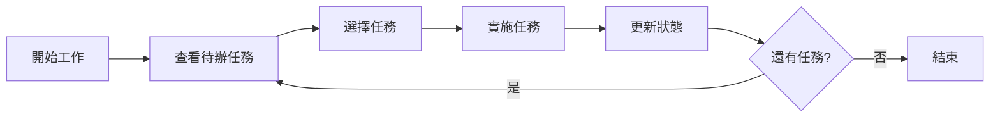

# Claude Task Master 工作流程指南

本文檔詳細說明使用 Claude Task Master 的各種工作流程和最佳實踐。

## 目錄

1. [基本工作流程](#基本工作流程)
2. [PRD 驅動開發](#prd-驅動開發)
3. [任務管理流程](#任務管理流程)
4. [協作工作流程](#協作工作流程)
5. [與 MCP Server 協同](#與-mcp-server-協同)
6. [進階工作流程](#進階工作流程)

## 基本工作流程

### 1. 專案初始化流程

```bash
# 步驟 1：初始化專案
task-master init

# 步驟 2：配置 AI 模型
task-master models --setup

# 步驟 3：建立或導入 PRD
# 選項 A：從現有 PRD 檔案
task-master parse-prd docs/requirements.txt

# 選項 B：互動式建立
task-master create-prd
```

### 2. 日常開發流程



實際命令：

```bash
# 早上開始工作
task-master next              # 獲取下一個任務
task-master show 15           # 查看任務詳情

# 開始實施
task-master set-status --id=15 --status=in-progress

# 需要研究時
task-master research "How to implement OAuth 2.0?" --save-to=15

# 完成任務
task-master set-status --id=15 --status=done
task-master next              # 繼續下一個任務
```

## PRD 驅動開發

### 1. PRD 準備

建立結構化的 PRD 文檔：

```markdown
# 專案名稱：任務管理系統

## 專案概述
建立一個現代化的任務管理 Web 應用程式。

## 核心功能
1. 使用者認證系統
   - 註冊/登入功能
   - JWT token 認證
   - 密碼重設功能

2. 任務管理
   - CRUD 操作
   - 任務分類和標籤
   - 優先級設定
   
3. 團隊協作
   - 任務分配
   - 評論系統
   - 即時通知

## 技術規格
- 前端：React + TypeScript
- 後端：Node.js + Express
- 資料庫：PostgreSQL
- 認證：JWT

## 非功能需求
- 響應時間 < 200ms
- 支援 1000+ 並發用戶
- 99.9% 可用性
```

### 2. PRD 解析流程

```bash
# 解析 PRD 生成任務
task-master parse-prd .taskmaster/docs/prd.txt

# 檢視生成的任務
task-master list

# 輸出範例：
# ┌────┬─────────────────────────────┬────────┬──────────┬──────────────┐
# │ ID │ Title                       │ Status │ Priority │ Dependencies │
# ├────┼─────────────────────────────┼────────┼──────────┼──────────────┤
# │ 1  │ Setup project structure     │ pending│ high     │ []           │
# │ 2  │ Implement authentication    │ pending│ high     │ [1]          │
# │ 3  │ Create task CRUD API        │ pending│ high     │ [1]          │
# │ 4  │ Design database schema      │ pending│ high     │ [1]          │
# │ 5  │ Implement frontend routing  │ pending│ medium   │ [1]          │
# └────┴─────────────────────────────┴────────┴──────────┴──────────────┘
```

### 3. 任務優化流程

```bash
# 分析任務複雜度
task-master analyze-complexity --research

# 查看分析報告
task-master complexity-report

# 基於分析擴展任務
task-master expand --id=2 --num=5  # 為任務 2 生成 5 個子任務

# 或擴展所有高複雜度任務
task-master expand --all --threshold=7
```

## 任務管理流程

### 1. 任務狀態管理

```
pending → in-progress → done
   ↓           ↓          ↑
blocked ← on-hold ────────┘
```

命令示例：

```bash
# 開始任務
task-master set-status --id=10 --status=in-progress

# 暫停任務
task-master set-status --id=10 --status=on-hold --reason="等待 API 文檔"

# 標記阻塞
task-master set-status --id=10 --status=blocked --reason="依賴任務 8 未完成"

# 完成任務
task-master set-status --id=10 --status=done
```

### 2. 任務依賴管理

```bash
# 添加依賴
task-master add-dependency --id=15 --depends-on=14

# 移除依賴
task-master remove-dependency --id=15 --depends-on=14

# 驗證依賴關係
task-master validate-dependencies

# 查看依賴圖
task-master dependency-graph
```

### 3. 任務更新流程

```bash
# 更新單個任務
task-master update-task --id=20 --prompt="需要添加錯誤處理"

# 批量更新
task-master update --from=20 --prompt="所有 API 端點需要添加速率限制"

# 更新子任務
task-master update-subtask --id=20.3 --prompt="使用 Redis 實現快取"
```

## 協作工作流程

### 1. Git 分支協作

```bash
# 為功能分支建立任務標籤
git checkout -b feature/user-auth
task-master add-tag --from-branch

# 切換分支時自動切換任務上下文
git checkout feature/payment
task-master use-tag feature-payment

# 合併前檢查任務狀態
task-master check-branch-tasks
```

### 2. 團隊任務分配

```bash
# 分配任務（使用註解）
task-master annotate --id=25 --note="@alice 請負責這個任務"

# 查看指派給特定人員的任務
task-master list --filter="@alice"

# 建立團隊進度報告
task-master team-report --format=markdown > team-status.md
```

### 3. Code Review 流程

```bash
# PR 提交前檢查
task-master pre-commit-check

# 生成任務完成報告
task-master generate-pr-description --id=15,16,17

# 輸出範例：
# ## 完成的任務
# - [x] #15: 實現用戶登入 API
# - [x] #16: 添加 JWT token 生成
# - [x] #17: 建立認證中間件
# 
# ## 測試覆蓋
# - 單元測試：15 個
# - 整合測試：5 個
# - 覆蓋率：87%
```

## 與 MCP Server 協同

### 1. 研究驅動開發

```bash
# Step 1: Task Master 識別需要研究的任務
task-master show 30  # "實現 OAuth 2.0 整合"

# Step 2: 使用 Perplexity 進行深度研究
task-master research "OAuth 2.0 implementation best practices 2024" \
  --save-to=30 --detail=high

# Step 3: 使用 Context7 查詢相關文檔
# 在 Claude Code 中：
"使用 Context7 查詢 Passport.js OAuth 策略文檔"

# Step 4: 實施並記錄決策
task-master update-subtask --id=30.1 \
  --prompt="決定使用 Passport.js，原因：成熟穩定、社群支援好"
```

### 2. 程式碼分析協作

```bash
# Step 1: Task Master 顯示重構任務
task-master show 45  # "重構認證模組"

# Step 2: 使用 Serena 分析現有程式碼
# 在 Claude Code 中：
"使用 Serena 分析 src/auth 目錄的程式碼結構"

# Step 3: 使用 Zen MCP 生成重構計劃
"使用 Zen MCP 的 refactor 功能分析認證模組"

# Step 4: 更新任務計劃
task-master update-task --id=45 --prompt="基於分析結果更新實施計劃"
```

### 3. 知識累積流程

```bash
# 任務完成後
task-master set-status --id=50 --status=done

# 自動觸發知識儲存
# 在 Claude Code 中：
"將任務 50 的實施經驗和踩坑記錄儲存到 OpenMemory"

# 未來查詢
"從 OpenMemory 查詢之前實施認證功能的經驗"
```

## 進階工作流程

### 1. 迭代開發流程

```bash
# Sprint 規劃
task-master sprint-plan --duration=2w --capacity=40h

# 每日站立會議
task-master daily-standup

# Sprint 回顧
task-master sprint-review --generate-report

# 輸出範例：
# Sprint 2 回顧報告
# ==================
# 完成任務：15/18 (83%)
# 延遲任務：3
# 總故事點：42/50
# 
# 亮點：
# - OAuth 整合提前完成
# - 測試覆蓋率達到 90%
# 
# 改進點：
# - 需要更好的任務估算
# - 加強文檔更新
```

### 2. 緊急修復流程

```bash
# 建立緊急任務
task-master add-task --prompt="修復生產環境登入問題" \
  --priority=critical --tag=hotfix

# 快速研究
task-master research "JWT token expiration issues" --quick

# 追蹤修復進度
task-master track --id=99 --real-time

# 生成事後報告
task-master incident-report --id=99
```

### 3. 大型重構流程

```bash
# 階段 1：分析現有架構
task-master analyze-codebase --output=architecture-report.md

# 階段 2：生成重構計劃
task-master refactor-plan --scope=backend --approach=incremental

# 階段 3：建立重構任務
task-master create-refactor-tasks --from-plan=refactor-plan.json

# 階段 4：追蹤進度
task-master refactor-progress --visual

# 輸出視覺化進度：
# Backend Refactoring Progress
# ============================
# Authentication  [████████░░] 80%
# API Layer       [██████░░░░] 60%
# Database        [████░░░░░░] 40%
# Services        [██░░░░░░░░] 20%
# Overall         [█████░░░░░] 50%
```

### 4. 文檔同步流程

```bash
# 從任務生成文檔
task-master generate-docs --format=markdown

# 更新 README
task-master update-readme --auto

# 生成 API 文檔
task-master api-docs --from-tasks --output=docs/api.md

# 建立用戶指南
task-master user-guide --from-completed-tasks
```

## 最佳實踐總結

### 1. 任務粒度

- **好的任務**：具體、可測量、可在 1-2 天內完成
- **避免**：過於籠統或需要超過一週的任務

### 2. 依賴管理

- 保持依賴鏈簡單（最多 3-4 層）
- 定期檢查循環依賴
- 優先完成阻塞其他任務的工作

### 3. 狀態更新

- 每天開始時更新任務狀態
- 遇到阻塞立即標記
- 完成後及時關閉

### 4. 協作溝通

- 使用註解功能記錄重要決策
- 定期生成和分享進度報告
- 保持任務描述清晰準確

### 5. 持續改進

- 定期回顧任務估算準確度
- 收集並應用經驗教訓
- 優化工作流程

---

**文檔版本**：1.0  
**更新日期**：2025-06-22